# pcb-fault-detection

Companion project to https://github.com/aryan-programmer/pcb_fault_detection_ui

Contains all the code for training the model(s), and some of the more successful runs.

./test_images contains the images used in the demo at https://youtu.be/tCxNRT4C0cI

For an explanation on the methodology & steps followed see the below report. Note, that much of it has been adapted from the Markdown cells in the Jupyter Notebooks I wrote to pre-process the data & train the model.

## AI Project Lifecycle:

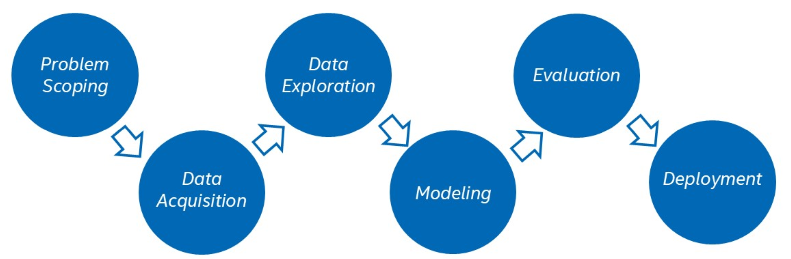

## Step 1: Problem Scoping

AI-Driven Optical PCB Inspection

Category: General problem

Description: Manual PCB inspections are time-consuming and error-prone. Develop a computer vision-based inspection tool to reduce inspection time and avoid costly field returns—especially critical in high-volume EMS environments.

## Step 2: Data Acquisiton

Here, we have gathered data from the following sources, with different types of data:

These data sources detail defects on the copper tracks: Used to train Model CopperTrack

- DsPCBSD+: https://universe.roboflow.com/pcb-egrla/dspcbsd/dataset/1
- MIXED PCB DEFECT DETECTION: https://data.mendeley.com/datasets/fj4krvmrr5/1
- PCB_DATASET: https://www.kaggle.com/datasets/akhatova/pcb-defects

This dataset contains annotated images of PCBs with some missing soldered components: This is used in the final YouTube demo, not for training though.

- PCB defects.v2i.yolov11: https://universe.roboflow.com/uni-4sdfm/pcb-defects/dataset/2

These datasets have annotated images of PCBs highlighting actual components, this can be used to identify missing components by comparing it with a known good PCB's output.

- pcb-oriented-detection: https://www.kaggle.com/datasets/yuyi1005/pcb-oriented-detection
- pcb-component-detection: https://sites.google.com/view/chiawen-kuo/home/pcb-component-detection
- FICS-PCB:
  - https://www.researchgate.net/publication/344475848_FICS-PCB_A_Multi-Modal_Image_Dataset_for_Automated_Printed_Circuit_Board_Visual_Inspection
  - https://trust-hub.org/#/data/fics-pcb
  - Also at https://universe.roboflow.com/erl-n2gvo/component-detection-caevk/browse
- PCB-Vision: https://arxiv.org/pdf/2401.06528 https://zenodo.org/records/10617721
- CompDetect Dataset: https://universe.roboflow.com/dataset-lmrsw/compdetect

## Step 3: Data Preprocessing & Exploration

### For the Copper Track Defect Detection model

#### DsPCBSD+ Dataset

From https://www.nature.com/articles/s41597-024-03656-8

Most comprehensive of all datasets, i.e. has most classes. So we have used its class names for the entire aggregated dataset.

```python
DSCPBSD_MAP = {
		0: SHORT,
		1: SPUR,
		2: SPURIOUS_COPPER,
		3: OPEN,
		4: MOUSE_BITE,
		5: HOLE_BREAKOUT,
		6: SCRATCH,
		7: CONDUCTOR_FOREIGN_OBJECT,
		8: BASE_MATERIAL_FOREIGN_OBJECT,
}
```

#### MIXED PCB DEFECT DATASET

From: https://data.mendeley.com/datasets/fj4krvmrr5/2

Has similar data, but is labelled differently, so we need to map the labels.

```python
MIXED_PCB_DEFECT_DATASET_MAPPING = {
		0: MISSING_HOLE,
		1: MOUSE_BITE,
		2: OPEN,
		3: SHORT,
		4: SPUR,
		5: SPURIOUS_COPPER,
}
```

#### PCB_DATASET

From https://www.kaggle.com/datasets/akhatova/pcb-defects by The Open Lab on Human Robot Interaction of Peking University

It is in Pascal VOC format, so we had to convert it to YOLO format.

```python
PCB_DATASET_MAPPING = {
		"missing_hole": MISSING_HOLE,
		"mouse_bite": MOUSE_BITE,
		"spurious_copper": SPURIOUS_COPPER,
		"short": SHORT,
		"spur": SPUR,
		"open_circuit": OPEN,
}
```

#### Sample Images

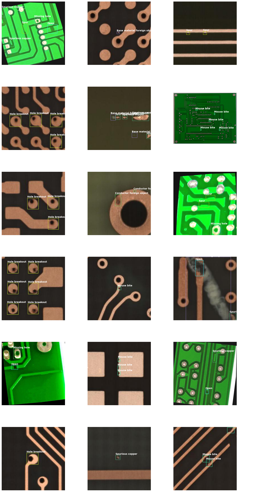

### For the Component Detection model

Class names to integer mapping:

```python
@enum.verify(enum.UNIQUE, enum.CONTINUOUS)
class Component(enum.IntEnum):
		battery = 0
		button = 1
		buzzer = 2
		capacitor = 3
		clock = 4
		connector = 5
		diode = 6
		display = 7
		fuse = 8
		heatsink = 9
		ic = 10
		inductor = 11
		led = 12
		pads = 13
		pins = 14
		potentiometer = 15
		relay = 16
		resistor = 17
		switch = 18
		transducer = 19
		transformer = 20
		transistor = 21
```

#### CompDetect Dataset

From: https://universe.roboflow.com/dataset-lmrsw/compdetect

This dataset helps detect components, but it is in Roboflow, which does not allow us to directly download the original images which are of higher quality. If you go to https://universe.roboflow.com/dataset-lmrsw/compdetect/dataset/23 and try to "Download Dataset" and select YoloV11 or something, the quality is terrible for the images. Also it contains many augmented images, which are not needed, we will do the augmenting ourselves, while training.

(This dataset is almost certainly copied from some other source, but it's not specified on the dataset page, and I could not find it during my data gathering/hunting, so I don't know what this hypothetical original source could be.)

So, the steps I took to download this are:

- Go to https://universe.roboflow.com/dataset-lmrsw/compdetect
- Select Fork Project
- Fill in the API_KEY and PROJECT_ID in my_secrets.py
- Run roboflow_download.py, this saves all images to ./temp_images
- Run roboflow_save_labels.py, this saves all data to ./temp_data, but it is in Roboflow JSON API response format so we have to convert it to the YOLO format manually.

#### FICS-PCB

Paper: https://www.researchgate.net/publication/344475848_FICS-PCB_A_Multi-Modal_Image_Dataset_for_Automated_Printed_Circuit_Board_Visual_Inspection

Download from: https://trust-hub.org/#/data/fics-pcb

The above link has a ~79GB dataset, with all the images in individual ZIPs, and the annotations are in a difficult to parse mix of CSV for the class labels and JSON for the bounding box positions.

But in the course of my data gathering/foraging I also found the dataset mirrored at https://universe.roboflow.com/erl-n2gvo/component-detection-caevk/. So, we will use the same methodology as the above CompDetect dataset, placing both the datasets images & labels in ./temp_images & ./temp_data together, and then parsing them at the same time into the YOLO format.

Also, The CompDetect also has some images from the WACV dataset, but not all of them, so we will need to remove these extra images. Luckily they have the same file names as the original, so it's easy to filter them out.

#### PCB-Vision

Paper at https://arxiv.org/pdf/2401.06528

Download from https://zenodo.org/records/10617721 (11GB)

This dataset is "interesting", we had to apply quite a bit of pre-processing, so much so that we have split it into a separate file "preprocess-pcb-vision.ipynb", that basically converts the dataset into a YOLO format stored at "./PCBVisionYolo". We then combine this converted dataset with the main dataset.

The original dataset specified the classes by using an grayscale image mask, which for each pixel in the image was set to a value indicating what was there.

- 0 = Nothing
- 1 = IC (shown below as red)
- 2 = Capacitor (shown below as green)
- 3 = Connectors (DIMM, GPU PCIe, etc. not berg strip or screw terminals) (shown below as blue)

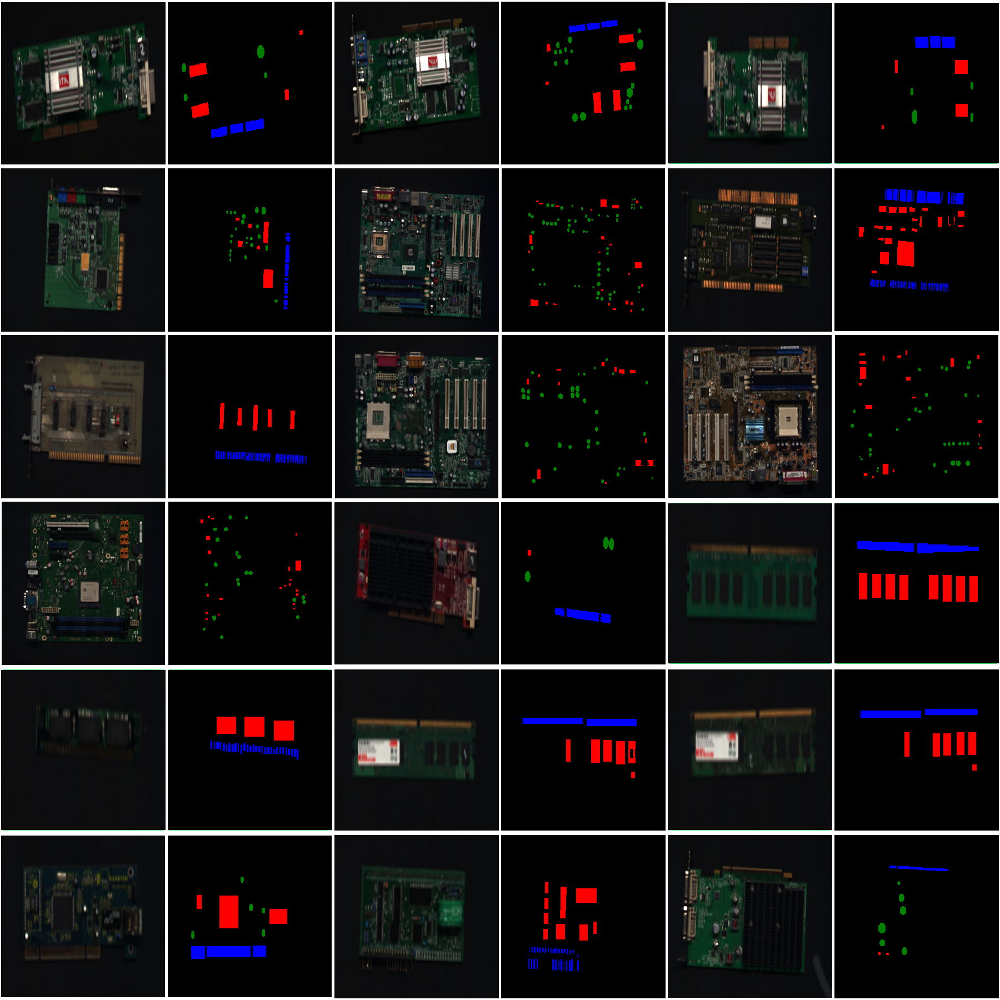

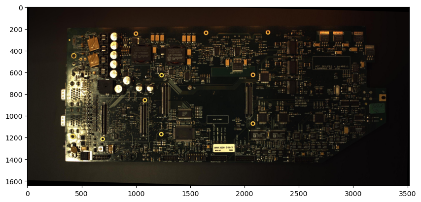

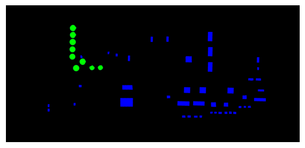

Unfortunately, this is not compatible with the YOLO format, so we need to convert it.

The file performs the following pre-processing steps:

- Straighten the images: some of the PCBs are tilted, this is not acceptable as it may cause issued with YOLO (though it may be OK for training it still leads to loose bounding boxes, also we do the data augmentation ourselves while training). For this we use PCB mask files from the dataset which specify which pixels of the image have the PCB. This is implemeted by the get_pcb_rotation function, which:
  - Takes in a PCB mask
  - Smoothes out any irregularities
  - Finds the largest contour (i.e. shape in general however strange it may be) in the image to get the PCB
  - Finds the smallest rotated bounding box to find the bounds of the PCB's contour
  - Then the rotate_copy rotates the image (& component mask) by the angle of this rotated bounding box to stratighten the PCB.
- Take the component mask, the for each component type, find all component's separate contours, and get all bounding boxes that fit those contours. We save this to the labels for YOLO.
- The images are very dark, and so we perform some basic color correction, by clipping the values in all the color channels to be less than it's 97.5 percentile.

Final result for this dataset:

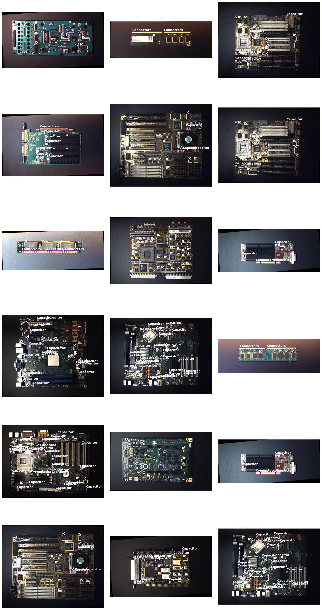

#### WACV: pcb-component-detection

From https://sites.google.com/view/chiawen-kuo/home/pcb-component-detection

This is in the Pascal VOC Format, so we must convert it to YOLO Format.

#### pcb-oriented-detection

From: https://www.kaggle.com/datasets/yuyi1005/pcb-oriented-detection

Contains oriented bounding boxes, so we need to convert them to regular bounding boxes.

The file performs the following pre-processing steps:

- Finds the tightest regular bounding boxes that fit the oriented bounding boxes and saves this.
- The images are (also) dark here, and so we perform some basic color correction, by clipping the values in all the color channels to be less than it's 97.5 percentile.

Has many more classes, usually redundant, classes, so we need to make a large class mapping.

#### Tiling

Many of the datasets have really tiny bounding boxes for the small SMD components, so we need to split these images up into larger images, and convert their bounding box annotations appropriately, so that the model can train better as the small SMD components will be (comparatively) larger.

This is like [Slicing Aided Hyper Inference (SAHI)](https://ieeexplore.ieee.org/document/9897990), but SAHI is only used for inference during deployment, not during training. So this process is called Tiling to differentiate it from Slicing, as Tiling is done during Training. This is probably not a new concept, but I could not find much existing code for this online.

The way it works is:

- It reads an image & it's corresponding bounding boxes.
- Finds the smallest dimensions from all bounding boxes in an image.
- Finds the size of the tile necessary to ensure that this smallest bounding box is at least 3% of the size of the tile.
- Crops the image into the tiles, while ensuring at least 10% overlap between the tiles, redistributing the overlap to ensure minimum clipping at the edges.

#### Sample images from consolidated & cropped dataset


## Step 4: Modelling

Here, we train 2 YOLOv11 nano models, one for each dataset/task using the Ultralytics library. After iterating this step and then evaluation, and tweaking the model parameters and the datasets, we get the final model.

## Step 5: Evaluation:

### Track Defect Detection Model

Here, we evaluate each model in 4 ways:

- on the entire dataset
- on the entire dataset, with single class (by combining all classes into i.e. consider all problem types as the same)
- on the large PCB images dataset
- on the large PCB images dataset, with single class

The best model has the following evaluation output:

<div>

<style scoped>
		.dataframe tbody tr th:only-of-type {
				vertical-align: middle;
		}

		.dataframe tbody tr th {
				vertical-align: top;
		}

		.dataframe thead th {
				text-align: right;
		}
</style>

<table border="1" class="dataframe">
	<thead>
		<tr style="text-align: right;">
			<th></th>
			<th></th>
			<th>box-p</th>
			<th>box-r</th>
			<th>box-f1</th>
			<th>box-map</th>
			<th>box-map50</th>
			<th>box-map75</th>
		</tr>
		<tr>
			<th></th>
			<th>class_name</th>
			<th></th>
			<th></th>
			<th></th>
			<th></th>
			<th></th>
			<th></th>
		</tr>
	</thead>
	<tbody>
		<tr>
			<th rowspan="10" valign="top">Full</th>
			<th>Short</th>
			<td>0.75861</td>
			<td>0.63978</td>
			<td>0.69415</td>
			<td>0.34406</td>
			<td>0.67146</td>
			<td>0.29448</td>
		</tr>
		<tr>
			<th>Spur</th>
			<td>0.76153</td>
			<td>0.53222</td>
			<td>0.62655</td>
			<td>0.34406</td>
			<td>0.67146</td>
			<td>0.29448</td>
		</tr>
		<tr>
			<th>Spurious copper</th>
			<td>0.61793</td>
			<td>0.64026</td>
			<td>0.62890</td>
			<td>0.34406</td>
			<td>0.67146</td>
			<td>0.29448</td>
		</tr>
		<tr>
			<th>Open</th>
			<td>0.70308</td>
			<td>0.70270</td>
			<td>0.70289</td>
			<td>0.34406</td>
			<td>0.67146</td>
			<td>0.29448</td>
		</tr>
		<tr>
			<th>Mouse bite</th>
			<td>0.69113</td>
			<td>0.55098</td>
			<td>0.61315</td>
			<td>0.34406</td>
			<td>0.67146</td>
			<td>0.29448</td>
		</tr>
		<tr>
			<th>Hole breakout</th>
			<td>0.81272</td>
			<td>0.96760</td>
			<td>0.88342</td>
			<td>0.34406</td>
			<td>0.67146</td>
			<td>0.29448</td>
		</tr>
		<tr>
			<th>Conductor scratch</th>
			<td>0.57191</td>
			<td>0.55369</td>
			<td>0.56265</td>
			<td>0.34406</td>
			<td>0.67146</td>
			<td>0.29448</td>
		</tr>
		<tr>
			<th>Conductor foreign object</th>
			<td>0.58090</td>
			<td>0.48402</td>
			<td>0.52805</td>
			<td>0.34406</td>
			<td>0.67146</td>
			<td>0.29448</td>
		</tr>
		<tr>
			<th>Base material foreign object</th>
			<td>0.67865</td>
			<td>0.75600</td>
			<td>0.71524</td>
			<td>0.34406</td>
			<td>0.67146</td>
			<td>0.29448</td>
		</tr>
		<tr>
			<th>Missing hole</th>
			<td>0.73747</td>
			<td>0.41842</td>
			<td>0.53391</td>
			<td>0.34406</td>
			<td>0.67146</td>
			<td>0.29448</td>
		</tr>
		<tr>
			<th>Full (Single Class)</th>
			<th>Combined</th>
			<td>0.77179</td>
			<td>0.65834</td>
			<td>0.71057</td>
			<td>0.37722</td>
			<td>0.74098</td>
			<td>0.32281</td>
		</tr>
		<tr>
			<th rowspan="6" valign="top">Large PCBs</th>
			<th>Short</th>
			<td>0.43373</td>
			<td>0.35714</td>
			<td>0.39173</td>
			<td>0.17780</td>
			<td>0.39143</td>
			<td>0.11074</td>
		</tr>
		<tr>
			<th>Spur</th>
			<td>0.51660</td>
			<td>0.23636</td>
			<td>0.32433</td>
			<td>0.17780</td>
			<td>0.39143</td>
			<td>0.11074</td>
		</tr>
		<tr>
			<th>Spurious copper</th>
			<td>0.47770</td>
			<td>0.42857</td>
			<td>0.45181</td>
			<td>0.17780</td>
			<td>0.39143</td>
			<td>0.11074</td>
		</tr>
		<tr>
			<th>Open</th>
			<td>0.66475</td>
			<td>0.43056</td>
			<td>0.52262</td>
			<td>0.17780</td>
			<td>0.39143</td>
			<td>0.11074</td>
		</tr>
		<tr>
			<th>Mouse bite</th>
			<td>0.50888</td>
			<td>0.40000</td>
			<td>0.44792</td>
			<td>0.17780</td>
			<td>0.39143</td>
			<td>0.11074</td>
		</tr>
		<tr>
			<th>Missing hole</th>
			<td>0.59376</td>
			<td>0.47629</td>
			<td>0.52858</td>
			<td>0.17780</td>
			<td>0.39143</td>
			<td>0.11074</td>
		</tr>
		<tr>
			<th>Large PCBs (Single Class)</th>
			<th>Combined</th>
			<td>0.59917</td>
			<td>0.42411</td>
			<td>0.49666</td>
			<td>0.19223</td>
			<td>0.43753</td>
			<td>0.11418</td>
		</tr>
	</tbody>
</table>

</div>

Here, we see that the best model does very well on the full dataset, and only a bit less on the large PCB dataset (even it's F1-vs-Confidence curve).

#### Confusion Matrix

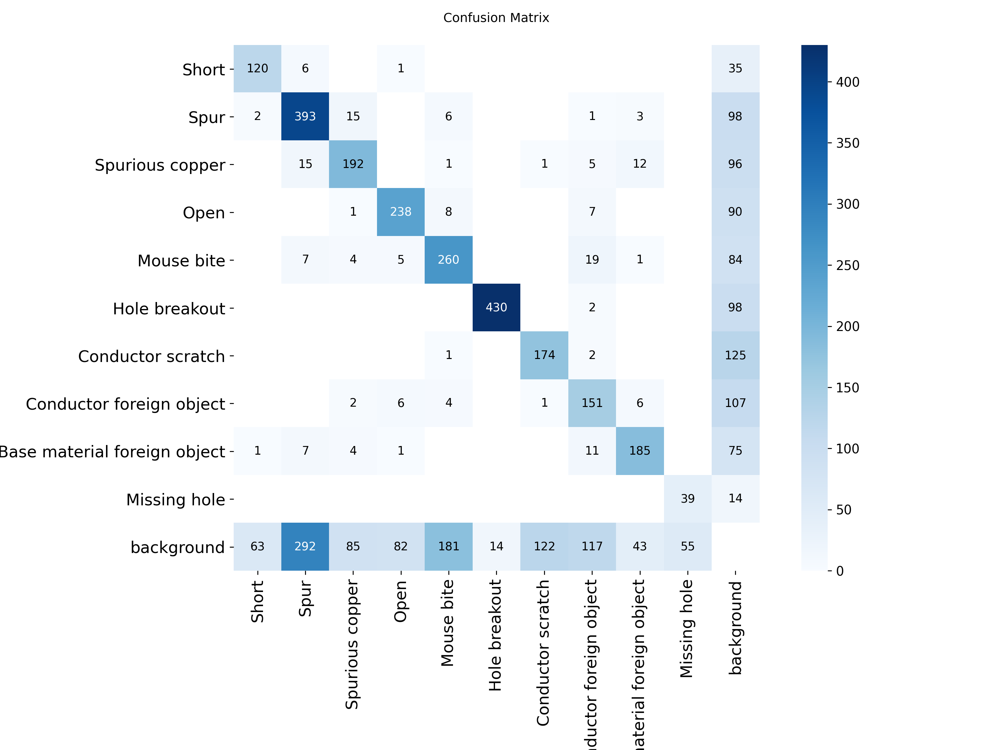

#### Normalized Confusion Matrix

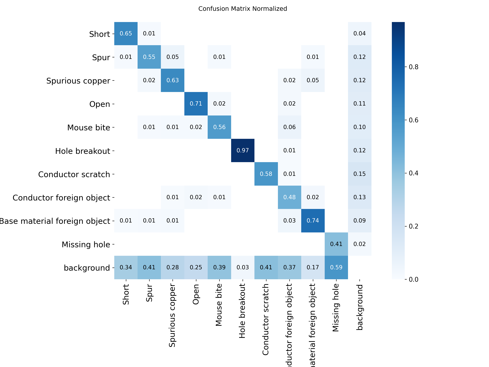

#### Precision-vs-Confidence Curve

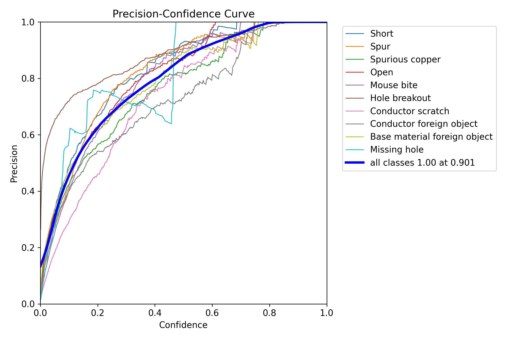

#### Recall-vs-Confidence Curve

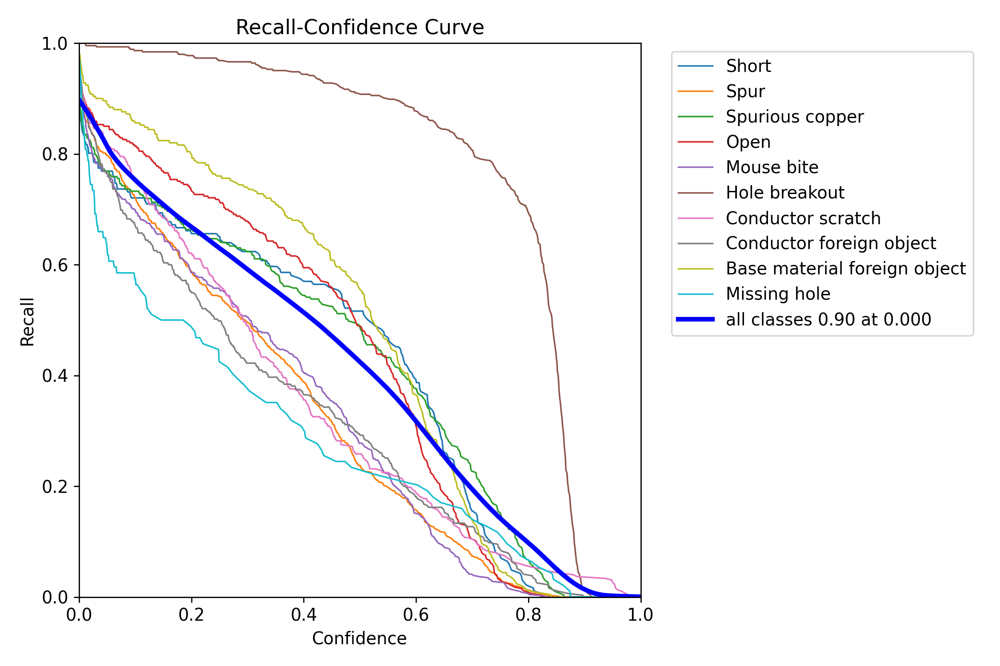

#### F1-vs-Confidence Curve

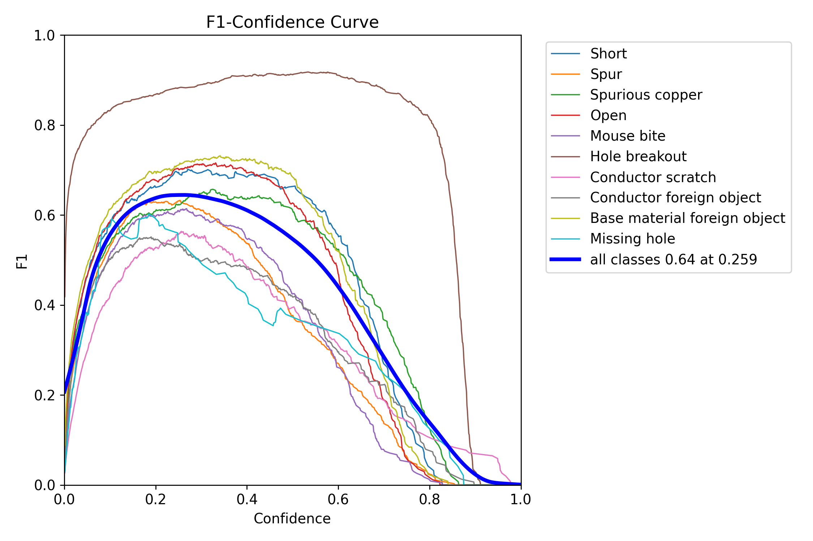

#### Precision-vs-Recall Curve

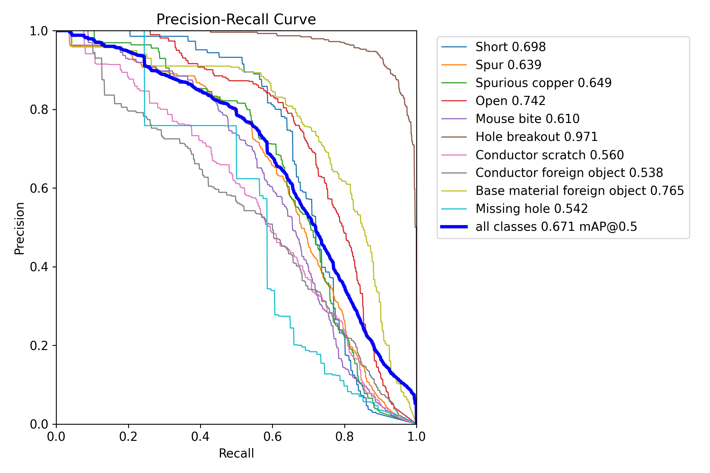

#### Results

The model does fairly well. We also see that it's F1-vs-Confidence curve on the general dataset is fairly wide and high, so it does fairly well in general, for a large range of confidence values, i.e. probability thresholds. It's confidence matrix shows high values, though it occasionally makes false positives, as seen in the "background" row.

The probability threshold it operates best at it 0.25 or 25%, which is what we will use for final deployment.

So, this is the model we will deploy to detect faults in the copper tracks. Thus, it is the final model for deployment **_Model CopperTrack_**.

### Component Detection Model

Here, we evaluate the model in 4 ways:

- on the entire dataset
- on the entire dataset, with single class (by combining all classes into i.e. consider all component types as the same)

The best here, has the following results:

<div>

<style scoped>
		.dataframe tbody tr th:only-of-type {
				vertical-align: middle;
		}

		.dataframe tbody tr th {
				vertical-align: top;
		}

		.dataframe thead th {
				text-align: right;
		}
</style>

<table border="1" class="dataframe">
	<thead>
		<tr style="text-align: right;">
			<th></th>
			<th></th>
			<th>box-p</th>
			<th>box-r</th>
			<th>box-f1</th>
			<th>box-map</th>
			<th>box-map50</th>
			<th>box-map75</th>
		</tr>
		<tr>
			<th></th>
			<th>class_name</th>
			<th></th>
			<th></th>
			<th></th>
			<th></th>
			<th></th>
			<th></th>
		</tr>
	</thead>
	<tbody>
		<tr>
			<th rowspan="19" valign="top">Full</th>
			<th>battery</th>
			<td>0.48056</td>
			<td>0.71429</td>
			<td>0.57457</td>
			<td>0.38478</td>
			<td>0.61576</td>
			<td>0.41728</td>
		</tr>
		<tr>
			<th>button</th>
			<td>0.88862</td>
			<td>0.36275</td>
			<td>0.51519</td>
			<td>0.38478</td>
			<td>0.61576</td>
			<td>0.41728</td>
		</tr>
		<tr>
			<th>buzzer</th>
			<td>0.91834</td>
			<td>0.84615</td>
			<td>0.88077</td>
			<td>0.38478</td>
			<td>0.61576</td>
			<td>0.41728</td>
		</tr>
		<tr>
			<th>capacitor</th>
			<td>0.85284</td>
			<td>0.62589</td>
			<td>0.72195</td>
			<td>0.38478</td>
			<td>0.61576</td>
			<td>0.41728</td>
		</tr>
		<tr>
			<th>clock</th>
			<td>0.60928</td>
			<td>0.41667</td>
			<td>0.49489</td>
			<td>0.38478</td>
			<td>0.61576</td>
			<td>0.41728</td>
		</tr>
		<tr>
			<th>connector</th>
			<td>0.60877</td>
			<td>0.48309</td>
			<td>0.53870</td>
			<td>0.38478</td>
			<td>0.61576</td>
			<td>0.41728</td>
		</tr>
		<tr>
			<th>diode</th>
			<td>0.68364</td>
			<td>0.55175</td>
			<td>0.61066</td>
			<td>0.38478</td>
			<td>0.61576</td>
			<td>0.41728</td>
		</tr>
		<tr>
			<th>display</th>
			<td>0.44909</td>
			<td>0.70000</td>
			<td>0.54715</td>
			<td>0.38478</td>
			<td>0.61576</td>
			<td>0.41728</td>
		</tr>
		<tr>
			<th>fuse</th>
			<td>0.59291</td>
			<td>0.80000</td>
			<td>0.68106</td>
			<td>0.38478</td>
			<td>0.61576</td>
			<td>0.41728</td>
		</tr>
		<tr>
			<th>ic</th>
			<td>0.71568</td>
			<td>0.83037</td>
			<td>0.76877</td>
			<td>0.38478</td>
			<td>0.61576</td>
			<td>0.41728</td>
		</tr>
		<tr>
			<th>inductor</th>
			<td>0.47205</td>
			<td>0.39218</td>
			<td>0.42842</td>
			<td>0.38478</td>
			<td>0.61576</td>
			<td>0.41728</td>
		</tr>
		<tr>
			<th>led</th>
			<td>0.68681</td>
			<td>0.49583</td>
			<td>0.57590</td>
			<td>0.38478</td>
			<td>0.61576</td>
			<td>0.41728</td>
		</tr>
		<tr>
			<th>pads</th>
			<td>0.31419</td>
			<td>0.05019</td>
			<td>0.08656</td>
			<td>0.38478</td>
			<td>0.61576</td>
			<td>0.41728</td>
		</tr>
		<tr>
			<th>pins</th>
			<td>0.21008</td>
			<td>0.31959</td>
			<td>0.25352</td>
			<td>0.38478</td>
			<td>0.61576</td>
			<td>0.41728</td>
		</tr>
		<tr>
			<th>potentiometer</th>
			<td>0.71059</td>
			<td>0.40948</td>
			<td>0.51956</td>
			<td>0.38478</td>
			<td>0.61576</td>
			<td>0.41728</td>
		</tr>
		<tr>
			<th>relay</th>
			<td>0.79690</td>
			<td>1.00000</td>
			<td>0.88697</td>
			<td>0.38478</td>
			<td>0.61576</td>
			<td>0.41728</td>
		</tr>
		<tr>
			<th>resistor</th>
			<td>0.86273</td>
			<td>0.65675</td>
			<td>0.74578</td>
			<td>0.38478</td>
			<td>0.61576</td>
			<td>0.41728</td>
		</tr>
		<tr>
			<th>switch</th>
			<td>0.87072</td>
			<td>0.68504</td>
			<td>0.76680</td>
			<td>0.38478</td>
			<td>0.61576</td>
			<td>0.41728</td>
		</tr>
		<tr>
			<th>transistor</th>
			<td>0.75751</td>
			<td>0.66376</td>
			<td>0.70754</td>
			<td>0.38478</td>
			<td>0.61576</td>
			<td>0.41728</td>
		</tr>
		<tr>
			<th>Full (Single Class)</th>
			<th>Combined</th>
			<td>0.84495</td>
			<td>0.66326</td>
			<td>0.74316</td>
			<td>0.42653</td>
			<td>0.73219</td>
			<td>0.44990</td>
		</tr>
	</tbody>
</table>

</div>

#### Confusion Matrix

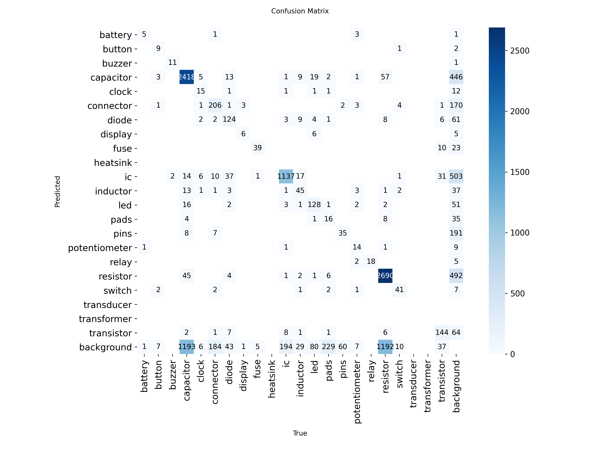

#### Normalized Confusion Matrix

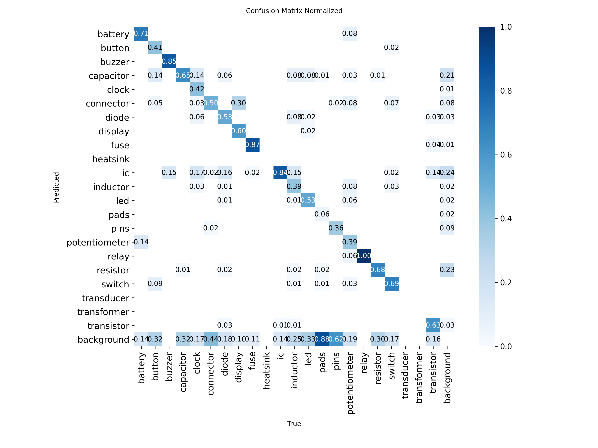

#### Precision-vs-Confidence Curve

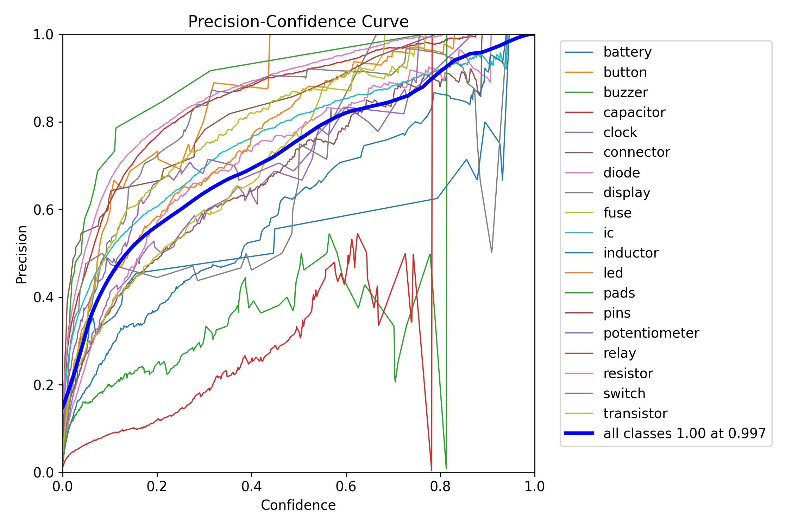

#### Recall-vs-Confidence Curve

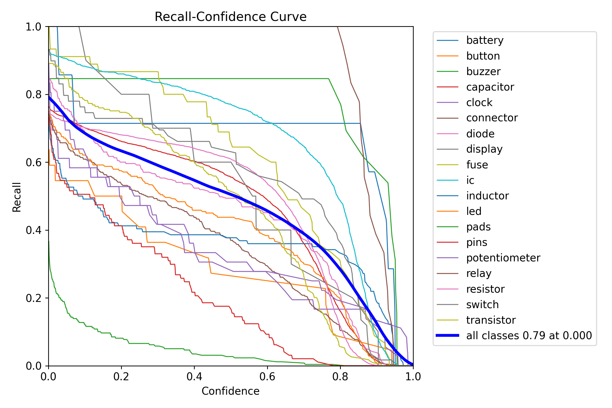

#### F1-vs-Confidence Curve

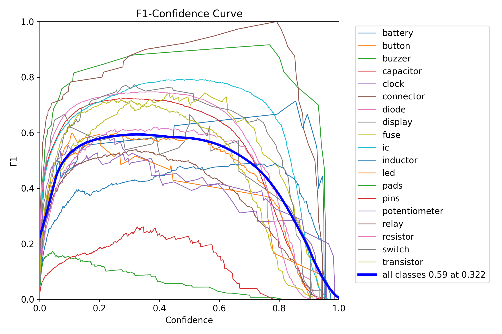

#### Precision-vs-Recall Curve

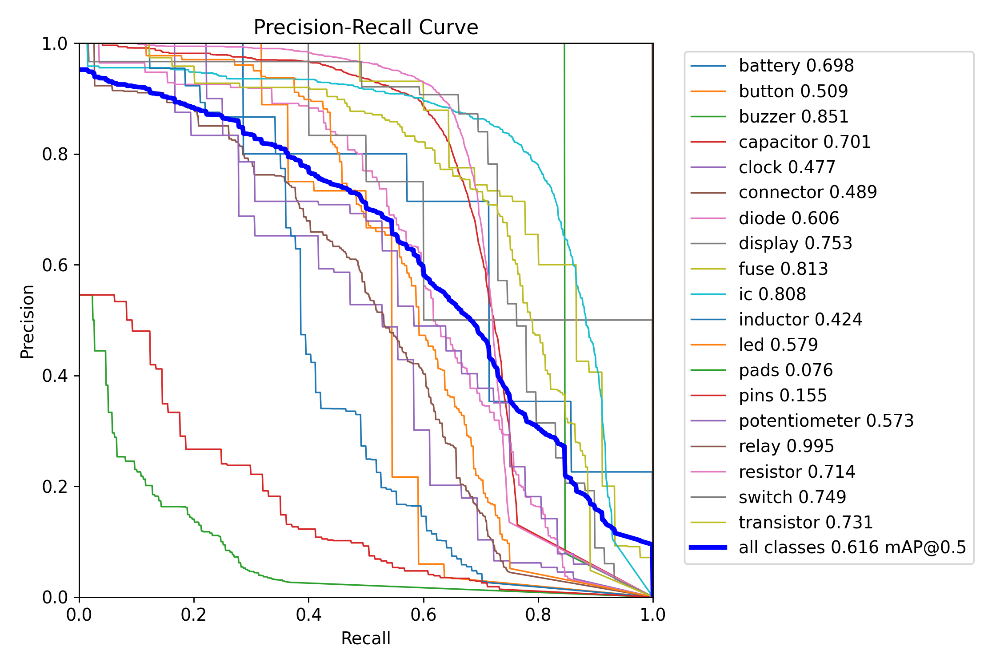

#### Results

Here, again we also see that the model does fairly well. We, again, also see that it's F1-vs-Confidence curve on the general dataset is very wide and high, so it does fairly well in general, for a large range of confidence values, i.e. probability thresholds. It's confidence matrix shows high values, though it occasionally makes false positives, as seen in the "background" row.

The probability threshold it operates best at it 0.322 or 32%, we will round it down to 30% and use it for final deployment.

## Step 6: Model Deployment

Export the models to ONNX for deployment.

See https://github.com/aryan-programmer/pcb_fault_detection_ui for the final deployed desktop application.

Also, view the demo at https://youtu.be/tCxNRT4C0cI on YouTube. Here, ./test_images contains the images used in the demo
